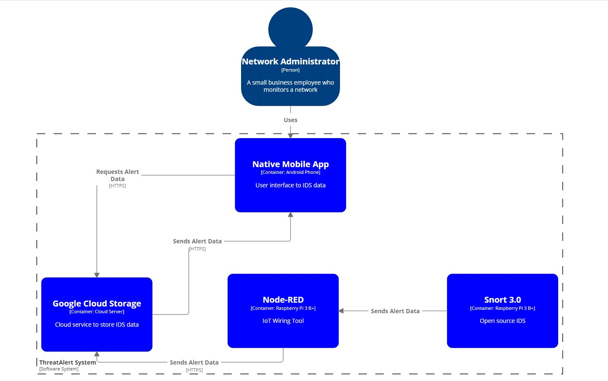
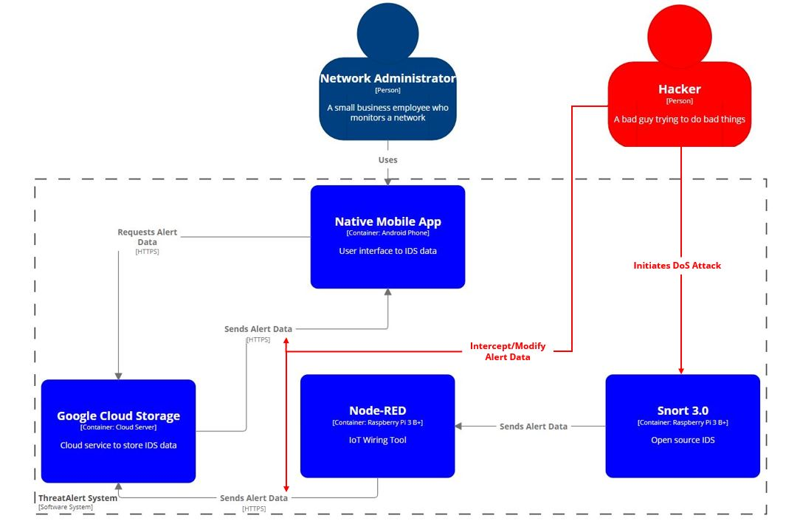

# ThreatAlert

## Executive Summary
### Problem Statement
Numerous threat actors consistently aim to cause harm to information systems. While news outlets typically only cover major attacks against large enterprises, small businesses are often targeted due to their poor cyber security strategy or complete lack thereof. The [2018 Hiscox Small Business Cyber Risk Report](https://www.hiscox.com/documents/2018-Hiscox-Small-Business-Cyber-Risk-Report.pdf) noted that 47% of small businesses experienced at least one cyber attack while 44% had two to four attacks. As part of a larger security strategy, organizations must have the capability to detect and repsond quickly to these threats. A major obstacle for many of these small businesses in developing and implementing a strong defensive posture is the cost. 

### Project Goals 
* Create an inexpensive IDS suitable to process the network traffic of a small business
* Utilize a cloud storage service to store IDS data
* Create a native Android mobile app that presents IDS data to a user

### Project Merits
ThreatAlert in conjunction with an open source IDS solution provides a low cost detection mechanism for a small business with a limited cyber security budget to implement monitoring of their internal network for threats. Immediate notifications of detected threats enables the organization's personnel to respond to a potential attack quicker to minimize the impact. 

## User Stories
As a **small business network administrator**, I want to **receive security alert notifications** so I can **respond to detected threats quickly**. 
**Acceptance Criteria:**
* The Android phone displays an app notification when ThreatAlert receives a new event alert.

As a **small business network administrator**, I want to **access historical alert data** so I can **review threats to see trends**. 
**Acceptance Criteria:**
* The ThreatAlert app successfully pulls and accurately displays alert data pulled from the data's storage.

As a **small business network administrator**, I want to **monitor the health of the IDS** so I can **verify the IDS is operating efficiently**. 
**Acceptance Criteria:**
* The ThreatAlert app successfully pulls and accurately displays the performance data of the IDS.

## Misuser Stories
As a **hacker**, I want to **perform a denial of service attack on the IDS** so I can **evade detection**. 
**Mitigations:**
* Utilize NAT to hide the internal IP address.
* Utilize IP whitelisting on the network firewall
* Perform a normalization period to determine and set an expected minimum alert threshold

As a **hacker**, I want to **intercept and modify IDS alerts in transit** so I can **evade detection**. 
**Mitigations:**
* Enforce HTTPS usage for all web service traffic
* Set WPA2-AES encryption on all network access points
* Implement static ARP tables on network switches and routers
* Perform a normalization period to determine and set an expected minimum alert threshold

## High Level Design

## Component List
### Native Mobile App
The ThreatAlert native Android mobile app provides a user interface to access IDS alert and performance data.

### Google Cloud Storage
A cloud service for file storage with free and other low cost monthly plans.

#### Google Cloud API
An API web service used by the native mobile app to retrieve data from the cloud server.

### Snort 3.0
An open source IDS installed on a Raspberry PI 3 B+ board that inspects network traffic.

### Node-RED
An IoT wiring framework tool that handles moving IDS data files from the Raspberry Pi to the Google Cloud Storage.

## Security Analysis

| Component name | Category of vulnerability | Issue Description | Mitigation |
|----------------|---------------------------|-------------------|------------|
| Snort 3.0 | Denial of Service | This component is installed on the Raspberry Pi 3 B+ with limited CPU and memory resources that can be exhausted. | IP whitelisting should be employed such that only inbound connections from authorized IP addresses are accepted.|
| Node-RED | Man-in-the-Middle | This component, installed on the Raspberry Pi 3 B+, sends alert data which can be intercepted and modified before being forwarded or dropped entirely. | Configure the usage of the highest version of TLS and HTTPS. Implement static ARP tables on network switches and routers. Set WPA2-AES encryption on all network access points. |
| Google Cloud Storage | Man-in-the-Middle | Alert data in transit to the native mobile app can be intercepted and modified before being forwarded or dropped entirely. | Configure the usage of the highest version of TLS and HTTPS. |
